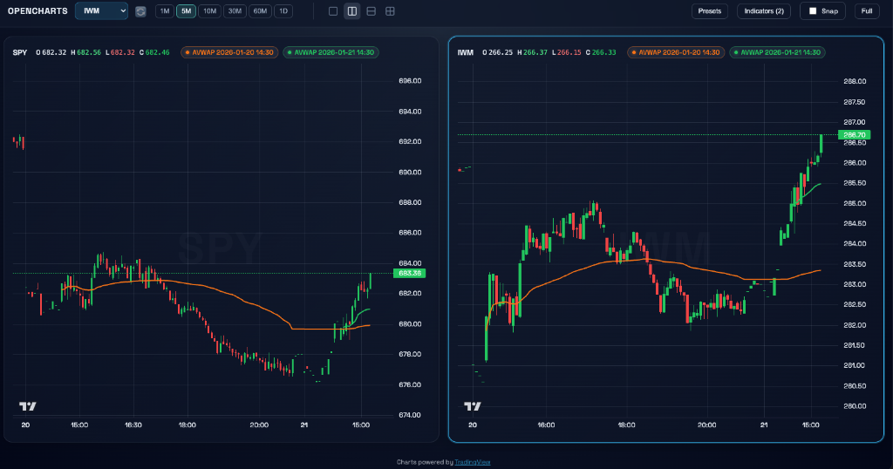

# OpenCharts

A feature-rich, open-source, browser-based candlestick charting application with multiple symbols, technical indicators, and real-time updates. Built with SvelteKit, Fastify, and TradingView Lightweight Charts.


## Features

- **Multi-symbol support**: SPY, QQQ, IWM, DIA, AAPL, MSFT, GOOGL, AMZN, NVDA, TSLA
- **Multiple timeframes**: 1m, 5m, 10m, 30m, 60m, 1D
- **13 technical indicators** with customizable parameters
- **Real-time price updates** with automatic refresh
- **Keyboard shortcuts** for power users
- **Shareable URLs** with encoded chart state
- **Indicator presets** for saving/loading configurations
- **Chart export** to PNG
- **Fullscreen mode** for focused analysis
- **Dark theme** optimized for trading
- **Multi-Chart Layouts** for simultaneous monitoring of multiple assets



## Use Cases

### For Traders
- **Multi-Chart Analysis**: Use the 2x2 or split-screen layouts to monitor correlated assets (e.g., SPY and VIX) or different timeframes (e.g., 5m and 1D) simultaneously.
- **Symbol Synchronization**: Toggle "Sync Symbol" to instantly switch all charts to a new ticker while maintaining their individual timeframe and indicator settings.
- **Technical Analysis**: Use professional-grade tools like Anchored VWAP, Bollinger Bands, and MACD to analyze price action.
- **Market Monitoring**: Keep track of multiple tickers (SPY, QQQ, NVDA, etc.) with real-time price updates.
- **Custom Setups**: Save your specific indicator configurations as presets for quick access.

### For Developers
- **Financial Visualization**: See how to implement high-performance candlestick charts using TradingView's Lightweight Charts library.
- **Real-time Data Handling**: Explore patterns for managing streaming data via WebSockets (or simulated streams) in a SvelteKit application.
- **Full-Stack Architecture**: Reference a clean monorepo structure separating a Fastify backend from a SvelteKit frontend.

### For Learners
- **Modern Web Stack**: Study a production-ready example combining SvelteKit, TypeScript, Fastify, and pnpm workspaces.
- **Data Engineering**: Understand how to mock financial data and cache it efficiently using SQLite.


## Quick Start

```bash
# Install dependencies
pnpm install

# Run development servers
pnpm dev
```

- Web UI: http://localhost:5173
- API: http://localhost:3001

By default, the API runs in mock mode using bundled candle data.

## Indicators

### Overlay Indicators (on price chart)

| Indicator | Description | Parameters |
|-----------|-------------|------------|
| **SMA** | Simple Moving Average | Length (default: 20), Source |
| **EMA** | Exponential Moving Average | Length (default: 20), Source |
| **Bollinger Bands** | Bollinger Bands | Length (default: 20), StdDev (default: 2) |
| **Anchored VWAP** | Volume-Weighted Average Price from anchor | Anchor datetime or click chart |

### Separate Pane Indicators

| Indicator | Description | Parameters |
|-----------|-------------|------------|
| **RSI** | Relative Strength Index | Length (default: 14), Source |
| **MACD Line** | Moving Average Convergence Divergence | Fast (12), Slow (26), Signal (9) |
| **MACD Signal** | MACD Signal Line | Fast (12), Slow (26), Signal (9) |
| **MACD Histogram** | MACD - Signal difference | Fast (12), Slow (26), Signal (9) |
| **Volume** | Trading volume bars | None |
| **Volume MA** | Volume Moving Average | Length (default: 20) |
| **ATR** | Average True Range | Length (default: 14) |

### Source Options

All applicable indicators support these price sources:
- `close` (default)
- `open`
- `high`
- `low`

## Keyboard Shortcuts

| Key | Action |
|-----|--------|
| `1` | Switch to 1m timeframe |
| `2` | Switch to 5m timeframe |
| `3` | Switch to 10m timeframe |
| `4` | Switch to 30m timeframe |
| `5` | Switch to 60m timeframe |
| `6` | Switch to 1D timeframe |
| `F` | Toggle fullscreen mode |
| `I` | Open/close indicators panel |
| `E` | Export chart as PNG |
| `Esc` | Close open panels |

## Sharing Charts

### URL Parameters

Share your chart configuration via URL:

```
https://your-domain.com/?symbol=AAPL&tf=5m&indicators=[...]
```

| Parameter | Description | Example |
|-----------|-------------|---------|
| `symbol` | Stock symbol | `AAPL`, `SPY`, `QQQ` |
| `tf` | Timeframe | `1m`, `5m`, `10m`, `30m`, `60m`, `1d` |
| `indicators` | URL-encoded JSON array | See below |

**Example shareable URL:**
```
http://localhost:5173/?symbol=SPY&tf=5m&indicators=%5B%7B%22type%22%3A%22sma%22%2C%22params%22%3A%7B%22length%22%3A20%2C%22source%22%3A%22close%22%7D%7D%5D
```

Click the **Share** button in the toolbar to copy the current chart URL to clipboard.

## Indicator Presets

Save your favorite indicator combinations:

1. Configure your indicators
2. Click **Presets** button
3. Enter a name and click **Save**
4. Load presets anytime by clicking on them

Presets are stored in browser localStorage and persist across sessions.

## Environment Configuration

### API (`apps/api/.env`)

```bash
# Data source: 'mock' or 'alpaca'
DATA_MODE=mock

# Alpaca credentials (required if DATA_MODE=alpaca)
ALPACA_API_KEY=your_key
ALPACA_API_SECRET=your_secret
ALPACA_BASE_URL=https://data.alpaca.markets

# Server config
PORT=3001
HOST=0.0.0.0
```

### Web (`apps/web/.env`)

```bash
VITE_API_URL=http://localhost:3001
```

## API Reference

### Endpoints

| Method | Endpoint | Description |
|--------|----------|-------------|
| `GET` | `/health` | Health check |
| `GET` | `/symbols` | List available symbols |
| `GET` | `/candles` | Fetch OHLCV candles |
| `GET` | `/latest` | Get latest price |

### GET /candles

Fetch historical candle data.

**Query Parameters:**
| Parameter | Type | Default | Description |
|-----------|------|---------|-------------|
| `symbol` | string | `SPY` | Stock symbol |
| `tf` | string | `5m` | Timeframe |
| `from` | ISO string | 90 days ago | Start time |
| `to` | ISO string | now | End time |

**Example:**
```bash
curl "http://localhost:3001/candles?symbol=AAPL&tf=5m&from=2024-01-01T00:00:00Z&to=2024-01-02T00:00:00Z"
```

**Response:**
```json
{
  "symbol": "AAPL",
  "timeframe": "5m",
  "candles": [
    {
      "timestamp": 1704205800000,
      "open": 185.50,
      "high": 185.75,
      "low": 185.25,
      "close": 185.60,
      "volume": 15000
    }
  ]
}
```

### GET /latest

Get the latest price for a symbol.

**Example:**
```bash
curl "http://localhost:3001/latest?symbol=SPY"
```

**Response:**
```json
{
  "symbol": "SPY",
  "price": 470.25,
  "timestamp": 1704220800000
}
```

### GET /symbols

List all available symbols.

**Response:**
```json
["SPY", "QQQ", "IWM", "DIA", "AAPL", "MSFT", "GOOGL", "AMZN", "NVDA", "TSLA"]
```

## Adding Custom Indicators

1. Create indicator file in `packages/indicators/src/indicators/`:

```typescript
// packages/indicators/src/indicators/my-indicator.ts
import type { Candle } from '@oss-charts/core';
import type { IndicatorPoint, IndicatorParams } from '../types';
import { getSourceValue } from '../types';

export function calculateMyIndicator(
  candles: Candle[],
  params: IndicatorParams
): IndicatorPoint[] {
  const length = params.length;
  const points: IndicatorPoint[] = [];

  for (let i = length - 1; i < candles.length; i++) {
    // Your calculation logic here
    const value = getSourceValue(candles[i], params.source);
    points.push({ timestamp: candles[i].timestamp, value });
  }

  return points;
}
```

2. Add type to `packages/indicators/src/types.ts`:

```typescript
export type IndicatorType = 
  | 'sma' 
  | 'ema' 
  // ... existing types
  | 'myIndicator';
```

3. Register in `packages/indicators/src/registry.ts`:

```typescript
import { calculateMyIndicator } from './indicators/my-indicator';

export const indicatorRegistry: Record<IndicatorType, IndicatorDefinition> = {
  // ... existing indicators
  myIndicator: {
    type: 'myIndicator',
    name: 'My Indicator',
    pane: 'overlay', // or 'separate'
    defaultParams: { length: 14, source: 'close' },
    label: (params) => `MyInd(${params.length})`,
    compute: calculateMyIndicator
  }
};
```

4. Export from `packages/indicators/src/index.ts`:

```typescript
export * from './indicators/my-indicator';
```

The indicator will automatically appear in the UI dropdown.

## Project Structure

```
oss-charts/
├── apps/
│   ├── api/                 # Fastify backend
│   │   ├── src/
│   │   │   ├── providers/   # Data providers (Alpaca, mock)
│   │   │   ├── services/    # Business logic
│   │   │   └── index.ts     # Server entry
│   │   └── data/            # Mock data & SQLite cache
│   └── web/                 # SvelteKit frontend
│       └── src/
│           ├── lib/         # Utilities & API client
│           └── routes/      # Page components
├── packages/
│   ├── core/                # Shared types & utilities
│   │   └── src/
│   │       ├── types.ts     # Candle, Timeframe types
│   │       ├── resample.ts  # Candle resampling logic
│   │       └── session.ts   # Market session helpers
│   └── indicators/          # Technical indicators
│       ├── src/
│       │   ├── indicators/  # Indicator implementations
│       │   ├── registry.ts  # Indicator definitions
│       │   └── types.ts     # Indicator types
│       └── test/            # Indicator tests
└── package.json
```

## Development Commands

```bash
pnpm install          # Install all dependencies
pnpm dev              # Run API + web in watch mode
pnpm test             # Run all unit tests
pnpm lint             # Run ESLint
pnpm format           # Run Prettier

# Run individual apps
pnpm --filter @oss-charts/api dev
pnpm --filter @oss-charts/web dev
```

## Data Caching

- 1-minute candles are cached in SQLite at `apps/api/data/cache.sqlite`
- Higher timeframes are resampled from cached 1m data
- Cache is cleared for the current trading day on API startup
- Mock mode generates synthetic data based on SPY price patterns

## Licensing and Attribution

This project uses [TradingView Lightweight Charts](https://github.com/tradingview/lightweight-charts) (Apache-2.0). Attribution appears in the UI footer. See `NOTICE` for details.

## Contributing

1. Fork the repository
2. Create a feature branch
3. Add tests for new functionality
4. Run `pnpm test` and `pnpm lint`
5. Submit a pull request

## License

MIT
