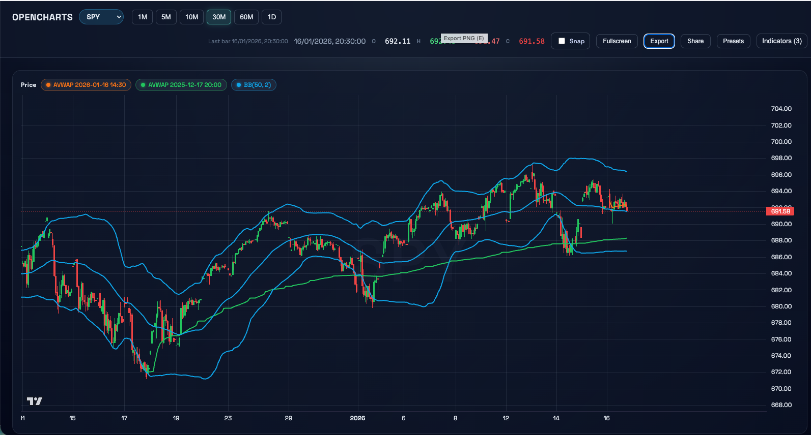

# OpenCharts

A browser-based candlestick charting application for technical analysis. Built with SvelteKit, Fastify, and TradingView Lightweight Charts.



## Overview

OpenCharts is a local, self-hosted charting app for viewing market candles and technical indicators. It runs a Fastify backend for data and a SvelteKit frontend for the chart UI. By default it uses bundled mock data, so you can run it without API credentials.

## Features

- **Multi-symbol support** in mock mode: SPY, QQQ, IWM, DIA, AAPL, MSFT, GOOGL, AMZN, NVDA, TSLA
- **Multiple timeframes**: 1m, 5m, 10m, 30m, 60m, 1D
- **11 technical indicators** with customizable parameters
- **Drawing tools**: trendlines, horizontal lines, Fibonacci retracements
- **Multi-chart layouts**: single, split, and 2x2 grid
- **Symbol sync** across charts
- **Indicator presets** saved in browser localStorage
- **Dark theme** optimized for charting
- **Mock or Alpaca data mode**

## Requirements

- [Node.js](https://nodejs.org/) 22 or later (CI uses 22)
- [pnpm](https://pnpm.io/) 9 or later (lockfile is `pnpm-lock.yaml`; root `package.json` pins `pnpm@9.12.3`)

## Quick Start

```bash
# Install dependencies
pnpm install

# Run the API and web UI in watch mode
pnpm dev
```

- Web UI: http://localhost:5173
- API: http://localhost:3001

By default, the API runs in mock mode using bundled candle data.

## Indicators

### Overlay indicators (on price chart)

| Indicator | Description | Parameters |
|-----------|-------------|------------|
| **SMA** | Simple Moving Average | Length (default: 20), Source |
| **EMA** | Exponential Moving Average | Length (default: 20), Source |
| **Bollinger Bands** | SMA ± standard-deviation bands | Length (default: 20), StdDev (default: 2) |
| **Anchored VWAP** | Volume-Weighted Average Price from anchor | Anchor datetime or click chart |

### Separate pane indicators

| Indicator | Description | Parameters |
|-----------|-------------|------------|
| **RSI** | Relative Strength Index | Length (default: 14), Source |
| **MACD Line** | MACD value | Fast (12), Slow (26), Signal (9) |
| **MACD Signal** | MACD signal line | Fast (12), Slow (26), Signal (9) |
| **MACD Histogram** | MACD − Signal | Fast (12), Slow (26), Signal (9) |
| **Volume** | Trading volume bars | None |
| **Volume MA** | Volume Moving Average | Length (default: 20) |
| **ATR** | Average True Range | Length (default: 14), Source |

### Source options

Indicators that operate on price inputs (SMA, EMA, RSI, Bollinger Bands, MACD variants, ATR) support these sources:

- `close` (default)
- `open`
- `high`
- `low`

## Drawing Tools

OpenCharts includes interactive drawing tools for technical analysis:

| Tool | Description | Usage |
|------|-------------|-------|
| **Trendline** | Diagonal line between two price points | Click start point, click end point |
| **Horizontal Line** | Infinite horizontal line at a price level | Single click at desired price |
| **Fibonacci Retracement** | Fibonacci levels (0, 0.236, 0.382, 0.5, 0.618, 0.786, 1) | Click high, click low |

To remove a drawing, right-click it and select **Remove**. Drawings and indicator presets are stored per-chart in browser `localStorage`.

## Environment Configuration

### API (`apps/api/.env`)

Copy from `apps/api/.env.example`:

```bash
# Data source: 'mock' or 'alpaca'
DATA_MODE=mock

# Alpaca credentials (required if DATA_MODE=alpaca)
ALPACA_API_KEY=your_key
ALPACA_API_SECRET=your_secret
ALPACA_BASE_URL=https://data.alpaca.markets

# Server config
PORT=3001
HOST=127.0.0.1
CORS_ORIGIN=http://localhost:5173
```

Additional API variables used by the backend:

| Variable | Default | Description |
|----------|---------|-------------|
| `ALPACA_DATA_FEED` | `iex` | Alpaca feed: `iex` or `sip` |
| `ALPACA_STREAM_URL` | `wss://stream.data.alpaca.markets/v2` | WebSocket base URL for real-time trades |
| `SQLITE_PATH` | `apps/api/data/cache.sqlite` | SQLite cache database path |

### Web (`apps/web/.env`)

Copy from `apps/web/.env.example`:

```bash
VITE_API_URL=http://localhost:3001
```

## API Reference

### Endpoints

| Method | Endpoint | Description |
|--------|----------|-------------|
| `GET` | `/health` | Health check |
| `GET` | `/symbols` | List available symbols |
| `GET` | `/candles` | Fetch OHLCV candles |
| `GET` | `/latest` | Get latest price |

### GET /candles

Fetch historical candle data.

**Query parameters:**

| Parameter | Type | Default | Description |
|-----------|------|---------|-------------|
| `symbol` | string | `SPY` | Stock symbol |
| `tf` | string | `5m` | Timeframe |
| `from` | ISO string | 90 days ago | Start time |
| `to` | ISO string | now | End time |

**Example:**

```bash
curl "http://localhost:3001/candles?symbol=AAPL&tf=5m&from=2024-01-01T00:00:00Z&to=2024-01-02T00:00:00Z"
```

**Response:**

```json
{
  "symbol": "AAPL",
  "timeframe": "5m",
  "candles": [
    {
      "timestamp": 1704205800000,
      "open": 185.50,
      "high": 185.75,
      "low": 185.25,
      "close": 185.60,
      "volume": 15000
    }
  ]
}
```

### GET /latest

Get the latest price for a symbol.

**Example:**

```bash
curl "http://localhost:3001/latest?symbol=SPY"
```

**Response:**

```json
{
  "symbol": "SPY",
  "price": 470.25,
  "timestamp": 1704220800000
}
```

### GET /symbols

List all available symbols in mock mode.

**Response:**

```json
["SPY", "QQQ", "IWM", "DIA", "AAPL", "MSFT", "GOOGL", "AMZN", "NVDA", "TSLA"]
```

## Adding Custom Indicators

1. Create an indicator file in `packages/indicators/src/indicators/`:

```typescript
// packages/indicators/src/indicators/my-indicator.ts
import type { Candle } from '@oss-charts/core';
import type { IndicatorPoint, IndicatorParams } from '../types';
import { getSourceValue } from '../types';

export function calculateMyIndicator(
  candles: Candle[],
  params: IndicatorParams
): IndicatorPoint[] {
  const length = params.length;
  const points: IndicatorPoint[] = [];

  for (let i = length - 1; i < candles.length; i++) {
    const value = getSourceValue(candles[i], params.source);
    points.push({ timestamp: candles[i].timestamp, value });
  }

  return points;
}
```

2. Add the type to `packages/indicators/src/types.ts`:

```typescript
export type IndicatorType =
  | 'sma'
  | 'ema'
  // ... existing types
  | 'myIndicator';
```

3. Register it in `packages/indicators/src/registry.ts`:

```typescript
import { calculateMyIndicator } from './indicators/my-indicator';

export const indicatorRegistry: Record<IndicatorType, IndicatorDefinition> = {
  // ... existing indicators
  myIndicator: {
    type: 'myIndicator',
    name: 'My Indicator',
    pane: 'overlay', // or 'separate'
    defaultParams: { length: 14, source: 'close' },
    label: (params) => `MyInd(${params.length})`,
    compute: calculateMyIndicator
  }
};
```

4. Export from `packages/indicators/src/index.ts`:

```typescript
export * from './indicators/my-indicator';
```

The indicator will appear in the UI dropdown automatically.

## Project Structure

```
├── apps/
│   ├── api/                 # Fastify backend
│   │   ├── src/
│   │   │   ├── providers/   # Data providers (Alpaca, mock)
│   │   │   ├── services/    # Business logic
│   │   │   └── index.ts     # Server entry
│   │   └── data/            # Mock data & SQLite cache
│   └── web/                 # SvelteKit frontend
│       └── src/
│           ├── lib/         # Utilities & API client
│           └── routes/      # Page components
├── packages/
│   ├── core/                # Shared types & utilities
│   │   └── src/
│   │       ├── types.ts     # Candle, Timeframe types
│   │       ├── resample.ts  # Candle resampling logic
│   │       └── session.ts   # Market session helpers
│   └── indicators/          # Technical indicators
│       ├── src/
│       │   ├── indicators/  # Indicator implementations
│       │   ├── registry.ts  # Indicator definitions
│       │   └── types.ts     # Indicator types
│       └── test/            # Indicator tests
└── package.json
```

## Production Deployment

Deploy OpenCharts to run as a polished, always-on application without needing local terminal windows.

### Recommended Stack (Free Tier)

| Component | Platform | Free Tier Limits |
|-----------|----------|------------------|
| **API Backend** | [Railway](https://railway.app) | 500 hours/month, 512MB RAM |
| **Web Frontend** | [Vercel](https://vercel.com) | Unlimited static, 100GB bandwidth |

### Deploy Backend to Railway

1. **Create a Railway account** at [railway.app](https://railway.app)

2. **Create new project** from GitHub:
   - Click "New Project" → "Deploy from GitHub repo"
   - Select your `opencharts` repository
   - Set the **Root Directory** to `apps/api`

3. **Configure environment variables** in Railway dashboard:
   ```
   NODE_ENV=production
   DATA_MODE=mock          # or 'alpaca' for live data
   PORT=3001
   HOST=0.0.0.0
   
   # If using Alpaca for live data:
   ALPACA_API_KEY=your_key
   ALPACA_API_SECRET=your_secret
   ALPACA_BASE_URL=https://data.alpaca.markets
   ```

4. **Add persistent volume** (optional, for SQLite cache):
   - Go to Settings → Volumes
   - Mount at `/app/apps/api/data`

5. **Deploy** - Railway will auto-detect the Dockerfile and build

6. **Copy your API URL** (e.g., `https://opencharts-api.up.railway.app`)

### Deploy Frontend to Vercel

1. **Create a Vercel account** at [vercel.com](https://vercel.com)

2. **Import project** from GitHub:
   - Click "Add New" → "Project"
   - Select your `opencharts` repository

3. **Configure build settings**:
   - **Framework Preset**: SvelteKit
   - **Root Directory**: `apps/web`
   - **Build Command**: `cd ../.. && pnpm --filter @oss-charts/core build && pnpm --filter @oss-charts/indicators build && pnpm --filter @oss-charts/web build`
   - **Install Command**: `cd ../.. && pnpm install`

4. **Set environment variable**:
   ```
   VITE_API_URL=https://your-railway-api-url.up.railway.app
   ```

5. **Deploy** - Vercel will build and deploy your frontend

### Alternative Platforms

| Platform | Good For | Notes |
|----------|----------|-------|
| **Fly.io** | API backend | Free tier: 3 shared VMs, use included Dockerfile |
| **Render** | Full stack | Free tier: 750 hours/month, spin-down after 15min |
| **Cloudflare Pages** | Frontend only | Unlimited requests, excellent CDN |
| **Netlify** | Frontend only | 100GB bandwidth, good SvelteKit support |

### Docker Deployment

For self-hosted or other Docker platforms, use the included Dockerfile:

```bash
# Build and run the API
cd apps/api
docker build -t opencharts-api .
docker run -p 3001:3001 -e DATA_MODE=mock opencharts-api
```

## Development Commands

Run from the repo root:

```bash
pnpm install          # Install all dependencies
pnpm dev              # Run API + web in watch mode
pnpm test             # Run all unit tests
pnpm lint             # Run ESLint
pnpm format           # Run Prettier
pnpm -r build         # Build all packages and apps
pnpm -r check         # Svelte type-check (run by CI)

# Run individual apps
pnpm --filter @oss-charts/api dev
pnpm --filter @oss-charts/web dev
```

## Data Caching

- 1-minute candles are cached in SQLite at `apps/api/data/cache.sqlite`
- Higher timeframes are resampled from cached 1m data
- The cache is invalidated for the current trading day on API startup
- Mock mode generates synthetic data based on SPY price patterns

## Licensing and Attribution

OpenCharts is released under the [MIT License](LICENSE).

This project uses [TradingView Lightweight Charts](https://github.com/tradingview/lightweight-charts) (Apache-2.0). Attribution appears in the UI footer. See [NOTICE](NOTICE) for details.

## Contributing

1. Fork the repository
2. Create a feature branch
3. Add tests for new functionality
4. Run `pnpm test` and `pnpm lint`
5. Submit a pull request
